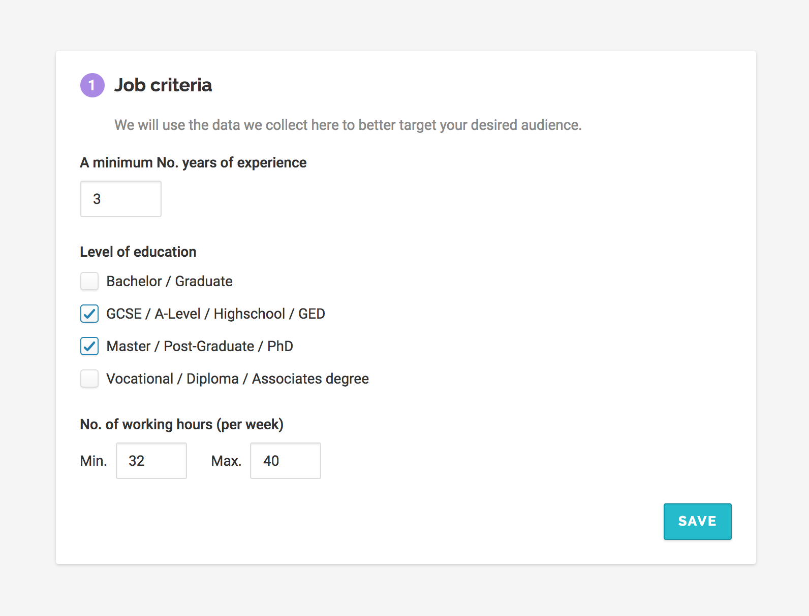
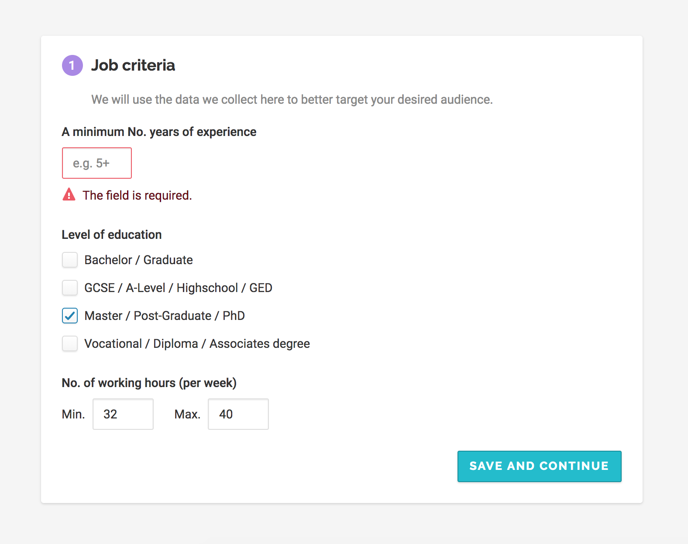
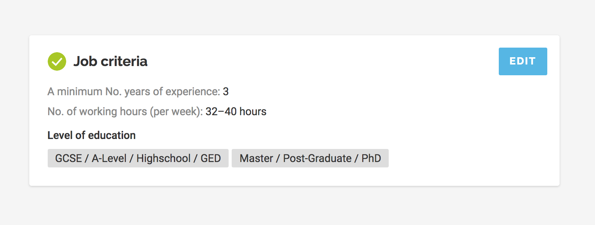

# Front-end developer test assignment for VONQ

Implement a form component. In default state years of experience are empty, no checkbox selected, working hours field has default values of 32 and 40.

By clicking “Save” button form should be validated and if valid should be changed to a summary. All fields are required.

By clicking “Edit” user sees form again and can edit it.

You can use icons in [assets](assets) directory.

## Design

Normal state:

Error:

Summary:

## Requirements

* Implement design as close as possible to provided images. We understand that we provide just a flat image, so we won't judge if something isn't “pixel perfect” to provided images. If you see something missing in designs, feel free to add. No need to implement custom checkboxes styles, just use native ones.
* Use ES2015 JavaScript syntax.
* Use React.
* Write tests.
* Feel free to use any tools/libraries you want.
* Component should work in all modern browsers and IE11.
* Include a readme file describing the component, your decisions, and any other useful information.

## Share with us

* Make your solution available on GitHub, GitLab, Bitbucket, etc.
* Deploy your solution somewhere so we can see how it's working in a browser. You can use [Netlify](https://www.netlify.com/), [GitHub Pages](https://pages.github.com/), or any other hosting.

Thank you! Talk to you soon.
